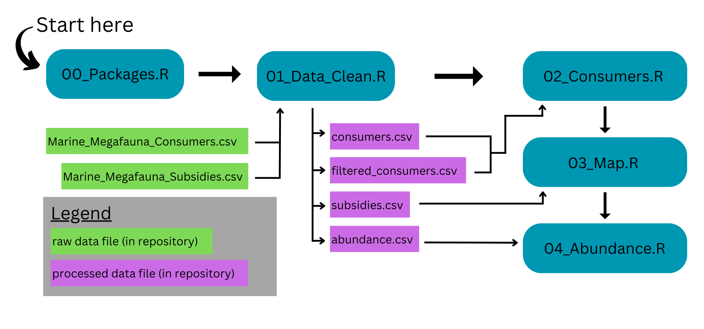

# Historical and potential future importance of marine megafauna subsidies to terrestrial ecosystems

**FD Gerraty**, CA Braman, JE Dugan, K Elder, KA Emery, BS Halpern, WN Heady, EHT Hiroyasu, GB Lewin, ES Nielsen, RY Oliver, M Reynolds, A Wegmann, RC Williams, R Wynn-Grant, HS Young, ZL Zilz

Marine megafauna connect land and sea by serving as large, calorically-rich food sources for terrestrial consumers and by transferring marine-derived nutrients onto land as eggs, placenta, excreta, and carcasses. In this project, we review the role of marine megafauna - particularly marine mammals and sea turtles - as connectors of marine and terrestrial ecosystems along global coastlines. We compile published literature to describe the diversity of terrestrial consumers that exploit marine megafauna as a food source, as well as descriptions of documented ecological consequences resulting from megafauna-mediated nutrient subsidies from marine to terrestrial ecosystems. Here, we provide an overview of the datasets and scripts associated with this repository.

------------------------------------------------------------------------

There are four primary R scripts required to run all console and data preparation, data cleaning, analysis, and visualization steps:

-   **00_Packages.R** loads every package that is needed in following scripts. After running this script, all following scripts can be run independently.

-   **01_Data_Clean.R** cleans and summarizes raw data files. It also calculates values and summaries presented in the manuscript main text.

-   **02_Consumers.R** generates the sankey/alluvial plots in Figure 2.

-   **03_Map.R** generates the maps and histograms in Figure 3.

-   **04_Abundance.R** generates Figure 4.

These scripts depend on the following R packages: tidyverse (v2.0.0), janitor (v2.2.1), ggalluvial (v0.12.5), ggpubr (v0.6.0), sf (v1.0.20), rnaturalearth (v1.0.1), rnaturalearthdata (v1.0.0), ggthemes (v5.1.0).

------------------------------------------------------------------------

There are two primary datasets associated with this repository:

1.  **Marine Megafauna Consumers:** All of the terrestrial vertebrate consumers of marine megafauna captured in our synthetic literature review (see manuscript for review methods). The cleaned dataset is accessible at [`data/processed/consumers.csv`](https://github.com/fgerraty/Marine_Megafauna_Subsidies/blob/main/data/processed/consumers.csv). See [`data/README.md`](https://github.com/fgerraty/Marine_Megafauna_Subsidies/blob/main/data/README.md) for data dictionary and additional details.

2.  **Marine Megafauna Subsidies:** All of the case studies captured in our synthetic literature review that documented an ecological consequence in terrestrial ecosystems arising from (1) marine megafauna consumption by terrestrial consumers, (2) marine megafauna vectored nutrient subsidies to terrestrial ecosystems, or (3) indirect effects of marine megafauna. The cleaned dataset is accessible at [`data/processed/subsidies.csv`](https://github.com/fgerraty/Marine_Megafauna_Subsidies/blob/main/data/processed/subsidies.csv). See [`data/README.md`](https://github.com/fgerraty/Marine_Megafauna_Subsidies/blob/main/data/README.md) for data dictionary and additional details.

There is one additional dataset associated with this repository, "Marine Megafauna Abundance" ([`data/processed/abundance.csv`](https://github.com/fgerraty/Marine_Megafauna_Subsidies/blob/main/data/processed/abundance.csv)) that is derived from [Lotze and Worm (2009)](https://doi.org/10.1016/j.tree.2008.12.004) and includes historical and recent abundance estimates of marine mammal and sea turtle populations. See [`data/README.md`](https://github.com/fgerraty/Marine_Megafauna_Subsidies/blob/main/data/README.md) for data dictionary and additional details.

------------------------------------------------------------------------

## Marine Megafauna Consumers Data Summary

In our literature review we identified 224 unique combinations (235 total, but these were not necessarily unique due to uncertainty of megafauna or consumer taxonomic level) between a marine megafauna species and a terrestrial vertebrate consumer species. Additional results not presented in the manuscript, and the megafauna-consumer species pairs, are presented here. Additional details including taxonomic categorizations and reference links are accessible at [**data/processed/consumers.csv**](https://github.com/fgerraty/Marine_Megafauna_Subsidies/blob/main/data/processed/consumers.csv)

**Additional Results**

-   42 unique species pairs involved cetaceans as a food source, 63 species pairs involved pinnipeds (seals and sea lions) as a food source, 8 species pairs involved fissipeds (sea otters) as a food source, 2 species pairs involved sirenians (manatees and dugongs) as a food source, and 109 species pairs involved sea turtles as a food source.

-   We identified 96 unique terrestrial consumer species in 35 families. The families with the most number of unique consumer species were Canidae (11 species), Mustelidae (9 species), Colubridae (7 species), and Laridae (7 species).

-   Predation: We identified 53 unique pairs of terrestrial predators hunting marine megafauna prey. These predator-prey interactions consisted of 33 unique predator species and 19 unique marine megafauna species. Most predator-prey interactions involved sea turtles as prey (27 species pairs), followed by pinnipeds (19 pairs), fissipeds (4 pairs), cetaceans (2 pairs), and sirenians (1 pair). The predator families with the greatest number of unique predator-prey species pairs were Canidae (11 pairs), Ursidae (9 pairs), and Felidae (6 pairs).

-   Scavenging: We identified 89 unique species pairs of terrestrial vertebrates scavenging marine megafauna carrion. These scavenging interactions consisted of 38 unique scavenger species and 41 unique marine megafauna species. Most scavenging interactions involved pinnipeds as a food source (41 pairs), followed by cetaceans (34 pairs), sea turtles (7 pairs), fissipeds (6 pairs), and sirenians (1 pair). The scavenger families with the greatest number of unique megafauna scavenging species pairs were Canidae (26 pairs), Cathartidae (13 pairs), and Ursidae (9 pairs).

-   Placenta Consumption: We identified 11 unique species pairs of terrestrial vertebrates consuming marine mammal placentas. These interactions consisted of 10 unique consumer species total and 8 unique marine megafauna species, all of which were pinnipeds. The placenta consumers consisted of birds (8 species pairs), carnivores (2 species pairs) and one reptile species (the Galapagos marine iguana).

-   Excreta Consumption: We identified 4 unique species pairs of terrestrial vertebrates consuming marine megafauna excreta. These interactions consisted of 3 unique consumer species total and 3 unique marine megafauna species, all of which were pinnipeds. The placenta consumers consisted of birds (3 species pairs) and one reptile species (the Galapagos marine iguana).

-   Egg Consumption: We identified 88 unique species pairs involving all seven sea turtle species and their terrestrial vertebrate egg predators, and 51 unique sea turtle egg consumer species total. The egg predators were taxonomically diverse, spanning 22 families of mammals, birds, and reptiles. The most common nest predators were canids (Canidae, n=20), mustelids (Mustelidae, n=11), monitor lizards (Varanidae, n=8), and colubrid snakes (Colubridae, n=7).

| Marine Megafauna Species | Consumer Species | Interaction Type(s) | Source(s) |
|:-----------------|:-----------------|:-----------------|:-----------------|
| **Cetaceans** |  |  |  |
| "cetacean" | Brown hyaena | Scavenging | Kuhn et al. (2010) |
| "dolphin" | Jaguar | Scavenging | Castañeda et al. (2013) |
| "dolphin" | Black-backed jackal | Unknown | Avery et al. (1987) |
| "whales" | Wolverine | Scavenging | Rausch and Pearson (1972) |
| "whales" | California condor | Scavenging | Chamberlain et al. (2005) |
| "whales" | Andean condor | Scavenging | Lambertucci et al. (2018) |
| "baleen whale" | Black-backed jackal | Unknown | Avery et al. (1987) |
| Beluga | Polar bear | Predation | Laidre et al. (2018), Smith and Sjare (1990), Rode et al. (2022) |
| Beluga | Gray wolf | Scavenging | Watts et al. (2010) |
| Bowhead whale | Polar bear | Scavenging | Laidre et al. (2018), Harwood et al. (2018), Rode et al. (2022) |
| Bowhead whale | Brown bear | Scavenging | Harwood et al. (2018) |
| Bryde's whale | Coyote | Unknown | Rose et al. (1998) |
| Common dolphin | Coyote | Unknown | Rose et al. (1998) |
| Cuvier’s beaked whale | Dingo | Scavenging | Behrendorff et al. (2016) |
| Fin whale | Polar bear | Scavenging | Laidre et al. (2018) |
| Fin whale | Coyote | Unknown | Rose et al. (1998) |
| Gray whale | Polar bear | Scavenging | Laidre et al. (2018) |
| Gray Whale | California condor | Scavenging | Kurle et al. (2016), Burnett et al. (2013) |
| Grey whale | Gray wolf | Scavenging | Watts et al. (2010), Roffler et al. (2023) |
| Harbor porpoise | Red fox | Scavenging | Heers et al. (2017) |
| Harbor porpoise | Gray wolf | Unknown | Roffler et al. (2023) |
| Humpback whale | Brown bear | Scavenging | Lewis et al. (2014) |
| Humpback whale | Gray wolf | Scavenging | Lewis et al. (2014), Young et al (2022) |
| Humpback whale | Dingo | Scavenging | Behrendorff et al. (2016), Behrendorff et al (2018) |
| Humpback whale | Turkey vulture | Scavenging | Blásquez et al. (2016) |
| Humpback whale | Bald eagle | Scavenging | Young et al. (2022) |
| Humpback whale | Corvid (Corvidae) | Scavenging | Young et al. (2022) |
| Humpback whale | Gull (Laridae) | Scavenging | Young et al. (2022) |
| Humpback whale | Great blue heron | Scavenging | Young et al. (2022) |
| Humpback whale | American robin | Scavenging | Young et al. (2022) |
| Indo-pacific bottlenose dolphin | Dingo | Scavenging | Behrendorff et al. (2016) |
| Melon-headed whale | Dingo | Scavenging | Behrendorff et al. (2016), Behrendorff et al (2018) |
| Minke whale | Dingo | Scavenging | Behrendorff et al. (2016) |
| Narwhal | Polar bear | Predation, Scavenging | Laidre et al. (2018), Smith and Sjare (1990), Stern et al. (2024) |
| Orca | Dingo | Scavenging | Behrendorff et al. (2016) |
| Orca | Gray wolf | Scavenging | Roffler et al. (2023) |
| Pantropical spotted dolphin | Dingo | Scavenging | Behrendorff et al. (2016) |
| Pilot whale | Lion | Scavenging | Stander (2019) |
| Pygmy sperm whale | Dingo | Scavenging | Behrendorff et al. (2016) |
| Risso's dolphin | California condor | Scavenging | Kurle et al. (2016) |
| Sperm whale | Polar bear | Scavenging | Laidre et al. (2018) |
| Sperm whale | Dingo | Scavenging | Behrendorff et al. (2016) |
| Sperm whale | Gray wolf | Unknown | Roffler et al. (2023) |
| **Fissipeds** |  |  |  |
| Sea otter | Bald eagle | Predation, Scavenging | Sherrod et al. (1975), Anthony et al. (2008) |
| Sea otter | Raven | Scavenging | Esslinger (1999) |
| Sea otter | Brown bear | Predation | Monson et al. (1995), Monson et al. (2022) |
| Sea otter | Gray wolf | Predation, Scavenging | Watts et al. (2010), Roffler et al. (2021), Roffler et al. (2023) |
| Sea otter | California condor | Scavenging | Burnett et al. (2013) |
| Sea otter | Wolverine | Scavenging | Schneider and Faro (1975) |
| Sea otter | Red fox | Scavenging | Schneider and Faro (1975) |
| Sea otter | Coyote | Predation | Riedman and Estes (1990) |
| **Pinnipeds** |  |  |  |
| "seal" | Red fox | Scavenging | Schwemmer et al. 2021) |
| "seals" | Wolverine | Scavenging | Rausch and Pearson (1972) |
| "seals" | California condor | Scavenging | Chamberlain et al. (2005) |
| Antarctic fur seal | Brown skua | Scavenging, Consuming placenta | Carneiro et al. (2014) |
| Antarctic fur seal | Northern giant petrel | Scavenging | Gonzales-Solis et al. (2000) |
| Antarctic fur seal | Southern giant petrel | Scavenging | Gonzales-Solis et al. (2000) |
| Bearded seals | Polar bear | Predation | Stirling and Derocher (2012), Stern et al. (2024), Rode et al. (2022) |
| Bearded seals | Arctic fox | Scavenging | Smith (1980) |
| Bearded seals | Raven | Scavenging | Smith (1980) |
| California sea lion | California condor | Predation, Scavenging | Kurle et al. (2016), Tyner et al. (2013), Burnett et al. (2013) |
| California sea lion | Coyote | NA | Reid et al. (2018) |
| California sea lion | Gull (Laridae) | Scavenging | Varland et al. (2015) |
| California sea lion | Western gull | Consuming placenta | Aurioles and Llinas (1987) |
| California sea lion | Bald eagle | Scavenging | Varland et al. (2015) |
| California sea lion | Raven | Scavenging | Varland et al. (2015) |
| California sea lion | Turkey vulture | Scavenging | Varland et al. (2015) |
| California sea lion | Coyote | Unknown | Rose et al. (1998) |
| California sea lion | Mountain lion | Unknown | Wilton (2016) |
| Cape fur seal | Brown hyaena | Predation, Scavenging | Kuhn et al. (2010) |
| Cape fur seal | Black-backed jackal | Predation, Scavenging, Consuming placenta | Hiscocks and Perrin (1987), Oosthuizen et al. (1997) |
| Cape fur seal | Lion | Predation, Scavenging | Bridgeford (1984), Stander (2019) |
| Cape fur seal | Kelp gull | Predation | Gallagher et al (2015) |
| Galapagos fur seal | Galapagos hawk | Scavenging | Weisberg and Perez (2018) |
| Galapagos sea lion | Española mockingbird | Predation, Consuming placenta | Curry and Anderson (1987) |
| Galapagos sea lion | Vampire ground finch | Consuming placenta | Grant and Grant (2002) |
| Galapagos sea lion | Galapagos marine iguana | Consuming placenta, Consuming excreta | Wikelski and Wrege (2000) |
| Galapagos sea lion | Galapagos hawk | Scavenging | Weisberg and Perez (2018) |
| Grey seal | Herring gull | Scavenging | Ronconi et al. (2014) |
| Grey seal | Great black-backed gull | Scavenging, Consuming placenta | Selva N. et al. (2019), Ronconi et al. (2014), Quaggiotto et al. (2018) |
| Grey seal | Red fox | Scavenging, Consuming placenta | Selva N. et al. (2019), Culloch et al. (2012) |
| Harbor seal | Bald eagle | Predation, Scavenging, Consuming placenta | Galusha and Hayward (2002), Hayward (2009), Calambokidis and Steiger (1985) |
| Harbor seal | Coyote | Predation | Steiger et al. (1989) |
| Harbor seal | Polar bear | Predation | Thiemann et al. (2008) |
| Harbor seal | Gray wolf | Predation, Scavenging | Collins et al. (2018), Roffler et al. (2021), Roffler et al. (2023) |
| Harbor seal | Gull (Laridae) | Scavenging | Varland et al. (2015) |
| Harbor seal | Raven | Scavenging | Varland et al. (2015) |
| Harbor seal | Turkey vulture | Scavenging | Varland et al. (2015) |
| Harbor seal | California condor | Scavenging | Kurle et al. (2016) |
| Harbor seal | Peregrine falcon | Scavenging | Varland (2018) |
| Harbor seal | Mountain lion | Unknown | Allen et al. (2019), Wilton (2016) |
| Harbor seal | Black bear | Unknown | Steiger et al. (1989) |
| Harp seal | Coyote | Predation | Way and Horton (2004) |
| Harp seal | Polar bear | Predation | Smith and Sterling (2019), Stern et al. (2024) |
| hooded seals | Polar bear | Predation | Thiemann et al. (2008), Stern et al. (2024) |
| New Zealand fur seal | Dingo | Scavenging | Behrendorff et al. (2016) |
| Northern elephant seal | Coyote | Unknown | Reid et al. (2018) |
| Ringed seals | Polar bear | Predation, Scavenging | Stirling and Derocher (2012), Rode et al. (2022), Smith (1980) |
| Ringed seals | Arctic fox | Predation, Scavenging | Roth (2002), Smith (1980), Lydersen and Gjertz (1986) |
| Ringed seals | Raven | Scavenging | Smith (1980) |
| South American sea lion | Black vulture | Predation, Scavenging | Paves et al. (2008) |
| South American sea lion | Common vampire bat | Predation | Catenazzi and Donnelly (2008) |
| South American sea lion | Dog | Scavenging | Paves et al. (2008) |
| South American sea lion | Kelp gull | Scavenging | Paves et al. (2008) |
| South American sea lion | Dolphin gull | Consuming excreta | Yorio et al. (1996) |
| South American sea lion | Andean condor | Scavenging, Consuming placenta | Reeves and Leatherwood (1992), Gamarra-Toledo et al. (2023) |
| South American fur seal | Kelp gull | Consuming excreta | Seguel et al. (2017) |
| South American fur seal | Dolphin gull | Consuming excreta | Seguel et al. (2017) |
| South American fur seal | Andean condor | Scavenging | Gamarra-Toledo et al. (2023) |
| Southern elephant seal | Northern giant petrel | Scavenging | de Bruyn and Cooper (2005) |
| Southern elephant seal | Southern giant petrel | Scavenging | de Bruyn and Cooper (2005) |
| Steller sea lion | Gray wolf | Unknown | Collins et al. (2018), Roffler et al. (2021), Roffler et al. (2023) |
| Subantarctic fur seal | Brown skua | Scavenging, Consuming placenta | Gamble et al. (2019), Ryan (2023) |
| Subantarctic fur seal | "giant petrel" (Macronectes spp.) | Scavenging | Reeves and Leatherwood (1992) |
| Walrus | Polar bear | Predation, Scavenging | Laidre et al. (2018) |
| Walrus | Wolverine | Scavenging | Rausch and Pearson (1972) |
| Walrus | Red fox | Scavenging | Zabel and Taggart (1989) |
| Walrus | Gray wolf | Scavenging | Watts et al. (2010) |
| **Sea Turtles** |  |  |  |
| "sea turtle" | King Vulture | Scavenging | Escobar-Lasso et al. (2016) |
| "sea turtle" | Black vulture | Scavenging, Consuming eggs | Escobar-Lasso et al. (2016), Burger and Gochfeld (2013), Madden et al. (2008) |
| "sea turtle" | Crested caracara | Scavenging | Escobar-Lasso et al. (2016) |
| "sea turtle" | Mangrove black-hawk | Scavenging | Escobar-Lasso et al. (2016) |
| "sea turtle" | Black iguana | Scavenging | Escobar-Lasso et al. (2016) |
| "sea turtle" | Northern raccoon | Scavenging | Escobar-Lasso et al. (2016), Madden et al. (2008) |
| "sea turtle" | Dog | Consuming eggs | Madden et al. (2008) |
| "sea turtle" | American crocodile | Scavenging | Escobar-Lasso et al. (2016) |
| "sea turtle" | Mountain lion | Scavenging | Escobar-Lasso et al. (2016) |
| "sea turtle" | Coyote | Scavenging | Escobar-Lasso et al. (2016) |
| "sea turtle" | Eastern spotted skunk | Consuming eggs | Mroziak et al. (2000) |
| "sea turtle" | Common opossum | Scavenging | Escobar-Lasso et al. (2016), Madden et al. (2008) |
| "sea turtle" | Turkey vulture | Scavenging | Escobar-Lasso et al. (2016) |
| "sea turtle" | Loo-choo big-tooth snake | Consuming eggs | Matsumoto et al. (2021) |
| Flatback sea turtle | Wild boar | Consuming eggs | Whytlaw et al. (2013), Nordberg et al. (2019) |
| Flatback sea turtle | Dingo | Consuming eggs | Nordberg et al. (2019) |
| Flatback sea turtle | Yellow-spotted monitor | Consuming eggs | Nordberg et al. (2019), Blamires (2004) |
| Green sea turtle | Jaguar | Predation | Arroyo-Arce and Salom-Pérez (2015), Alfaro et al. (2016), Veríssimo et al. (2012) |
| Green sea turtle | Dog | Consuming eggs | Fowler (1979), Ruiz-Izaguirre et al. (2014), Fowler (1979) |
| Green sea turtle | Coyote | Consuming eggs | Shaver et al. (2020) |
| Green sea turtle | Turkey vulture | Consuming eggs | Fowler (1979) |
| Green sea turtle | Black vulture | Consuming eggs | Fowler (1979) |
| Green sea turtle | White-nosed coati | Consuming eggs | Fowler (1979), Tiwari et al. (2006) |
| Green sea turtle | European badger | Consuming eggs | Yilmaz et al. (2015), Shaver et al. (2020) |
| Green sea turtle | Golden jackal | Predation, Consuming eggs | Yilmaz et al. (2015), Brown and Macdonald (1995) |
| Green sea turtle | Wild boar | Consuming eggs | Yilmaz et al. (2015), Zárate et al. (2013) |
| Green sea turtle | Red fox | Consuming eggs | Yilmaz et al. (2015), Halls et al. (2018), O'Connor et al. (2017) |
| Green sea turtle | Northern raccoon | Consuming eggs | Engeman et al. (2005), Engeman et al. (2011) |
| Green sea turtle | Nine-banded armadillo | Consuming eggs | Engeman et al. (2005), Engeman et al. (2011) |
| Green sea turtle | Black rat | Predation, Consuming eggs | Caut et al. (2007), Stokes et al. (2024) |
| Green sea turtle | Nile monitor | Consuming eggs | Sampaio et al. (2022) |
| Green sea turtle | Kukri snake | Consuming eggs | Lin et al. (2023), Pike et al. (2016) |
| Green sea turtle | Stink ratsnake | Consuming eggs | Lin et al. (2023) |
| Green sea turtle | White-tailed deer | Scavenging | Morera et al. (2022) |
| Hawksbill sea turtle | Jaguar | Predation | Arroyo-Arce and Salom-Pérez (2015), Veríssimo et al. (2012) |
| Hawksbill sea turtle | Wild boar | Consuming eggs | Whytlaw et al. (2013) |
| Hawksbill sea turtle | Mongoose | Consuming eggs | Leighton et al. (2010), Leighton et al. (2010), Leighton et al. (2008) |
| Kemp's ridley sea turtle | Coyote | Consuming eggs | Shaver et al. (2020) |
| Kemp's ridley sea turtle | American badger | Consuming eggs | Shaver et al. (2020) |
| Kemp's ridley sea turtle | Northern raccoon | Consuming eggs | Shaver et al. (2020) |
| Kemp's ridley sea turtle | Wild boar | Consuming eggs | Shaver et al. (2020) |
| Leatherback sea turtle | Jaguar | Predation | Arroyo-Arce and Salom-Pérez (2015), Veríssimo et al. (2012), Restrepo et al. (2022) |
| Leatherback sea turtle | Nine-banded armadillo | Consuming eggs | Engeman et al. (2005), Engeman et al. (2011), Lasala et al. (2023) |
| Leatherback sea turtle | Northern raccoon | Consuming eggs | Engeman et al. (2011), Lasala et al. (2023) |
| Leatherback sea turtle | Asian water monitor | Consuming eggs | Sivasundar and Prasad (1996) |
| Leatherback sea turtle | Crested caracara | Predation, Consuming eggs | Tomillo et al. (2010) |
| Leatherback sea turtle | Yellow-crowned night heron | Predation, Consuming eggs | Tomillo et al. (2010) |
| Leatherback sea turtle | Great blue heron | Predation, Consuming eggs | Tomillo et al. (2010) |
| Leatherback sea turtle | Dog | Consuming eggs | De Wet (2012) |
| Leatherback sea turtle | Coyote | Consuming eggs | Lasala et al. (2023) |
| Leatherback sea turtle | Honey badger | Consuming eggs | De Wet (2012) |
| Leatherback sea turtle | Mongoose | Consuming eggs | De Wet (2012) |
| Leatherback sea turtle | Monitor lizard (Varanus spp.) | Consuming eggs | De Wet (2012) |
| Loggerhead sea turtle | Lace monitor | Consuming eggs | Hof et al. (2019) |
| Loggerhead sea turtle | Yellow-spotted monitor | Consuming eggs | Nordberg et al. (2019), Hof et al. (2019), Lei and Booth (2017) |
| Loggerhead sea turtle | Northern raccoon | Predation, Consuming eggs | Bouchard and Bjorndal (2000), Engeman et al. (2005), Butler et al. (2020) |
| Loggerhead sea turtle | Black bear | Consuming eggs | Bjorndal (2020) |
| Loggerhead sea turtle | European badger | Consuming eggs | Yilmaz et al. (2015), Olgun et al. (2016), Baskale and Kaska (2013) |
| Loggerhead sea turtle | Red fox | Consuming eggs | Yilmaz et al. (2015), Olgun et al. (2016), Halls et al. (2018) |
| Loggerhead sea turtle | Gray fox | Predation, Consuming eggs | Stancyk (1982), Erb and Wyneken (2019) |
| Loggerhead sea turtle | Wild boar | Consuming eggs | Yilmaz et al. (2015), Nordberg et al. (2019), Olgun et al. (2016) |
| Loggerhead sea turtle | Golden jackal | Predation, Consuming eggs | Yilmaz et al. (2015) |
| Loggerhead sea turtle | Dingo | Consuming eggs | Nordberg et al. (2019) |
| Loggerhead sea turtle | Dog | Consuming eggs | Olgun et al. (2016), Patino-Martinez et al. (2021), Foote et al. (2000) |
| Loggerhead sea turtle | Nine-banded armadillo | Consuming eggs | Engeman et al. (2005), Butler et al. (2020), Engeman et al. (2011) |
| Loggerhead sea turtle | South American coati | Consuming eggs | López-Mendilaharsu et al. (2020) |
| Loggerhead sea turtle | Six-banded armadillo | Consuming eggs | López-Mendilaharsu et al. (2020) |
| Loggerhead sea turtle | Crab-eating fox | Consuming eggs | López-Mendilaharsu et al. (2020) |
| Loggerhead sea turtle | Coyote | Consuming eggs | Butler et al. (2020), Smith et al. (2020), Wauson and Rogers (2021) |
| Loggerhead sea turtle | Red wolf | Consuming eggs | Bailey et al. (1998) |
| Loggerhead sea turtle | Bobcat | Consuming eggs | Martin et al. (2005), Lindbord et al. (2016) |
| Loggerhead sea turtle | North American river otter | Consuming eggs | Butler et al. (2020) |
| Loggerhead sea turtle | American mink | Consuming eggs | Butler et al. (2020) |
| Loggerhead sea turtle | Honey badger | Consuming eggs | De Wet (2012) |
| Loggerhead sea turtle | Mongoose | Consuming eggs | De Wet (2012) |
| Loggerhead sea turtle | Eastern kingsnake | Consuming eggs | Butler et al. (2020) |
| Loggerhead sea turtle | Scarlet snake | Consuming eggs | Butler et al. (2019) |
| Loggerhead sea turtle | Coachwhip | Consuming eggs | Foote et al. (2000) |
| Loggerhead sea turtle | Eastern rat snake | Consuming eggs | Williams and Frick (2001) |
| Loggerhead sea turtle | Monitor lizard (Varanus spp.) | Consuming eggs | De Wet (2012) |
| Loggerhead sea turtle | Virginia opossums | Consuming eggs | Butler et al. (2020) |
| Loggerhead sea turtle | American crow | Consuming eggs | Butler et al. (2020) |
| Loggerhead sea turtle | Fish crow | Consuming eggs | Butler et al. (2020), Foote et al. (2000) |
| Loggerhead sea turtle | Black vulture | Consuming eggs | Stancyk (1982) |
| Loggerhead sea turtle | Turkey vulture | Consuming eggs | Stancyk (1982) |
| Loggerhead sea turtle | Great horned owls | Predation | Williams and Frick (2001) |
| Loggerhead sea turtle | Screech owls | Predation | Williams and Frick (2001) |
| Loggerhead sea turtle | Yellow-crowned night heron | Predation | Erb and Wyneken (2019), Bouchard and Bjorndal (2000) |
| Loggerhead sea turtle | Black-crowned night heron | Predation | Bouchard and Bjorndal (2000) |
| Loggerhead sea turtle | Gull (Laridae) | Predation | Erb and Wyneken (2019) |
| Olive ridley sea turtle | Jaguar | Predation | Alfaro et al. (2016), Escobar-Lasso et al. (2016), Morera-Chacón et al. (2019) |
| Olive ridley sea turtle | Wild boar | Consuming eggs | Whytlaw et al. (2013) |
| Olive ridley sea turtle | Asian water monitor | Consuming eggs | Maulany et al. (2012) |
| Olive ridley sea turtle | Dog | Predation, Consuming eggs | Reavis et al. (2022), Tripathy and Rajasekhar (2009), Espinoza-Rodríguez et al. (2023) |
| Olive ridley sea turtle | Northern raccoon | Consuming eggs | Reavis et al. (2022), Espinoza-Rodríguez et al. (2023) |
| Olive ridley sea turtle | Wood stork | Predation, Consuming eggs | Burger and Gochfeld (2013), Burger and Gochfeld (2014) |
| Olive ridley sea turtle | House crow | Predation | Tripathy and Rajasekhar (2009) |
| Olive ridley sea turtle | Brahminy kite | Predation | Tripathy and Rajasekhar (2009) |
| Olive ridley sea turtle | Black-headed gull | Predation | Tripathy and Rajasekhar (2009) |
| Olive ridley sea turtle | Black vulture | Predation, Consuming eggs | Burger and Gochfeld (2014), Burger and Gochfeld (2014), Espinoza-Rodríguez et al. (2023) |
| Olive ridley sea turtle | Striped hyena | Consuming eggs | Tripathy and Rajasekhar (2009) |
| Olive ridley sea turtle | Golden jackal | Consuming eggs | Tripathy and Rajasekhar (2009) |
| Olive ridley sea turtle | White-nosed coati | Consuming eggs | Garcıía et al. (2003), Espinoza-Rodríguez et al. (2023) |
| Olive ridley sea turtle | White-tailed deer | Scavenging | Morera et al. (2022) |
| Olive ridley sea turtle | Striped skunk | Consuming eggs | Espinoza-Rodríguez et al. (2023) |
| Olive ridley sea turtle | Tayra | Consuming eggs | Espinoza-Rodríguez et al. (2023) |
| Olive ridley sea turtle | Common opposum | Consuming eggs | Espinoza-Rodríguez et al. (2023) |
| Olive ridley sea turtle | Crested caracara | Predation, Consuming eggs | Espinoza-Rodríguez et al. (2023), Burger and Gochfeld (2014) |
| Olive ridley sea turtle | Great-tailed grackle | Predation, Consuming eggs | Burger and Gochfeld (2014) |
| Olive ridley sea turtle | Magnificent frigatebird | Predation | Burger and Gochfeld (2014) |
| Olive ridley sea turtle | Yellow-crowned night heron | Predation, Consuming eggs | Burger and Gochfeld (2014) |
| Olive ridley sea turtle | Coyote | Consuming eggs | Sosa-Cornejo et al. (2021) |
| Olive ridley sea turtle | Chicken | Consuming eggs | Burger and Gochfeld (2014) |
| Olive ridley sea turtle | Dingo | Consuming eggs | Whiting et al. (2007) |
| Olive ridley sea turtle | Turkey vulture | Consuming eggs | Burger and Gochfeld (2014) |
| **Sirenians** |  |  |  |
| Amazon manatee | Jaguar | Predation | Bertram and Bertram (1973) |
| Dugong | Dingo | Scavenging | Behrendorff et al. (2016), Behrendorff et al (2018) |

## Marine Megafauna Subsidy Effects Summary

In our literature review we identified 63 case studies documenting one or more ecological consequences of marine megafauna subsidies to terrestrial ecosystems. These are outlined below, with more details and reference links accessible at [**data/processed/subsidies.csv**](https://github.com/fgerraty/Marine_Megafauna_Subsidies/blob/main/data/processed/subsidies.csv)

| Type of Ecological Effect | Description | authors |
|:-----------------------|:-----------------------|:-----------------------|
| Other | Sea otter population declines were associated with changes in diet, dietary diversity, and breeding success and productivity of bald eagles in the Aleutian islands. | Anthony et al. (2008) |
| Consumer behavior | Polar bears, when on land, are spatially aggregated near scavenge subsidies in the form of subsistence-hunted bowhead whale “bone piles.” | Atwood et al. (2016) |
| Consumer health | Marine vertebrate consumption is associated with elevated total mercury (THg) levels among arctic foxes in island and mainland ecosystems in the Commander Islands and Iceland. | Bocharova et al. (2013) |
| Community- and ecosystem-level | Nitrogen vectored by pinnipeds and penguins increases (1) the rate of ecosystem respiration (2-5x higher), (2) the abundance of terrestrial arthropods (2-8x), and (3) species richness of springtails and mites (1.2-2.4x). | Bokhorst et al. (2019) |
| Community- and ecosystem-level | Heywood Lake has become more eutrophic over the past three decades as a consequence of Antarctic fur seal-induced nutrient enrichment. This has resulted in increased microbial abundance and changes in both community structure and seasonal patterns, some of which are related to winter anoxia. | Butler (1999) |
| Community- and ecosystem-level | Coverage of Deschampsia antarctica and Colobanthus quitensis, Antarctica's two species of vascular plants, increased dramatically on Signy Island between the 1960s and 2009. Coverage increase is likely due to climate warming and nutrient input from Antarctic fur seals. | Cannone et al. (2016) |
| Community- and ecosystem-level | Contrary to other findings, recognized fur seal disturbance was associated with larger and thicker moss banks on Signy Island. Seal disturbance was concentrated at low elevations, and the sensitivity of moss species to seal disturbance varied with species. | Cannone et al. (2017) |
| Consumer behavior | Brown skuas on bird island spend the majority of the breeding season feeding exclusively in coastal areas, where they consume carcasses and placentae of antarctic fur seals. | Carneiro et al. (2014) |
| Consumer abundance | In the absence of vegetation and terrestrial mammals, large colonies of common vampire bats persist by feeding on the South American sea lion. | Catenazzi et al. (2008) |
| Consumer behavior, Other | The solifuge Chinchippus peruvianus burrows in sand when disturbed, but in rocky areas sea lion carcasses provide alternative habitats for burrowing. Arthropod scavengers of pinniped carcasses are likely to be important dietary items for Chinchippus peruvianusm, based on the carbon and nitrogen isotopic values of two individuals. | Catenazzi et al. (2008) |
| Community- and ecosystem-level | Nutrient subsidies from loggerhead sea turtle nests increase the diversity and abundance of sandy beach meiofauna (particularly nematodes). | Diane et al. (2017) |
| Other | Global nutrient cycling model comparing within- and across-ecosystem nutrient movement before and after late-Quaternary terrestrial megafaunal extinctions and marine megafaunal population declines in recent centuries. Model estimates that marine mammal declines have led to significant declines in vertical and lateral nutrient transfer in the ocean, including a 77% reduction in upwards phosphorous movement from the deep ocean. Nutrients vectored by marine mammals are part of an "interlinked system recycling nutrients from the ocean depths to the continental interior." | Doughty et al. (2016) |
| Community- and ecosystem-level | Increasing Antarctic fur seal presence in the catchment of Antarctic (Signy Island) Heywood Lake is associated with elevated nutrient influx into the lake via surface runoff. | Ellis-Evans (1990) |
| Community- and ecosystem-level | Jaguar predation of sea turtle adults provides a sea turtle carrion subsidy to numerous terrestrial scavenger species. | Escobar-Lasso et al. (2016) |
| Community- and ecosystem-level | Galapágos sea lions are efficient vectors of marine nutrients into terrestrial ecosystem, leading to high nutrient concentrations and nutrient uptake by vegetation in low-elevation sites accessible to sea lions. | Farina et al. (2003) |
| Community- and ecosystem-level | Antarctic fur seal trampling and nutrient excretion decreases lichen diversity and modifies lichen community structure on Signy Island. Seal occurrence is associated with a large increase in soil N stock and decreased soil C:N ratio. | Favero-Longo et al. (2011) |
| Consumer abundance | Scavenging of marine megafauna may have provided a buffer that enabled coastal california condor populations to persist from the Pleistocene into the Holocene, despite widespread extinctions of terrestrial megafauna and their scavengers. | Fox-Dobbs et al. (2006) |
| Community- and ecosystem-level | Seal and seabird manuring is an important determinant of soil bacterial population size on Marion Island | French and Smith (1986) |
| Community- and ecosystem-level | Seal and seabird fertilized soils provide suitable abiotic conditions for invasive springtails (Collembola) on Marion Island. | Gabriel et al. (2008) |
| Consumer health | Individual propensities for contaminant-associated foraging behaviors (i.e. marine mammal scavenging) predict higher stress-induced glucocorticoid levels in wild condors. | Glucs et al. (2020) |
| Consumer behavior | Giant petrels exhibit two types of foraging trips: coastal trips (undertaken only by male northern giant petrels) to forage on seal and penguin carcasses, and pelagic trips for foraging at sea. Marine mammal carcass scavenging is sex-specific and involves notable changes in space use. | Gonzalez-Solis et al. (2002) |
| Consumer behavior, Consumer health | Satellite tracking revealed female Northern giant petrels foraged at sea, while males scavenged seal and penguin carcasses on the coast. Foraging efficiency (proportionate daily mass gain while foraging) was significantly greater for males than for females, suggesting a positive relationship between marine mammal/penguin scavenging and body condition. Sexual segregation in foraging may have arose from size-related dominance at carcasses, promoting sexual size dimorphism. | González-Solís et al. (2003) |
| Community- and ecosystem-level | Patches of Antarctic snow algae, one of the regions most significant primary producers and an important carbon sink, are associated with coastal areas and fertilized by seal and penguin faeces. Fertilization likely leads to elevated snow algae growth rates. | Gray et al. (2020) |
| Consumer health | Marine resource consumption is associated with elevated total mercury (THg) levels among arctic foxes in Svalbard, Norway. | Hallanger et al. (2019) |
| Community- and ecosystem-level | Loggerhead and green sea turtle nests enhance nitrogen in soil and foliar tissue of beach vegetation. | Hannan et al. (2007) |
| Community- and ecosystem-level | Increased vegetation disturbance and nutrient enrichment by Antarctic fur seals is associated with negative effects for disturbance-sensitive native vegetation and positive effects for invasive plant species. In nutrient-poor sub-Antarctic ecosystems the combination of disturbance by seal trampling and fertilization by seal manure creates a competitive advantage for exotic species over slow-growing natives. | Haussmann et al. (2013) |
| Community- and ecosystem-level | Phytoplankton density increased with increasing nutrient loading in Signy Island lakes. Antarctic fur seal fertilization is implicated in lake eutrophication. | Hawes (1990) |
| Consumer behavior | Harbor seal placentae and dead pups constitute a major component of the diet of bald eagles on Protection Island, WA. Eagles were more likely to land on seal haul-out beaches than in gull-nesting areas, and the presence of bald eagles was possitively associated with harbor seal presence. Three live predation events on harbor seal pups documented in Hayward (2009). | Hayward et al. (2010) |
| Community- and ecosystem-level | Nutrient cycling was greatly influenced by inputs from penguin and seal excreta in the maritime Antarctic (Signy Island). | Hodson (2006) |
| Consumer health | Wolverine liver contaminant profiles suggest that contamination from marine mammal sources, with potentially severe health consequences. | Hoekstra et al. (2003) |
| Community- and ecosystem-level | High measures of soil organic carbon, total nitrogen, and soil microbial biomass are "probably linked" to more abundant excreta and guano deposition by seals and seabirds. | Hopkins et al. (2020) |
| Consumer health | Marine mammal scavenging by coastal California condors exposes condors to potentially harmful levels of a suite of marine contaminants. | Kurle et al. (2016) |
| Consumer behavior | The ability to detect food across long distances enables arctic foxes to detect marine-mammal carcasses far beyond their home ranges, allowing for more efficient utilization of marine foods (and potentially elevated rates of marine-to-terrestrial nutrient transfer). Marine mammal scavenging alters fox diet and space use. | Lai et al. (2015) |
| Consumer health, Consumer behavior | Climate change threatens the ability of polar bears to hunt seals on sea ice, yet scavenging of large whale carcasses may have provided a nutritional refuge for polar bears during past interglacial periods and into a future ice-free arctic. Cetacean carcasses can be a large component of polar bear diets and alter polar bear space use, intraspecific interactions, abundance, and resilience to climate change. | Laidre et al. (2018) |
| Community- and ecosystem-level | Marine nutrients vectored into terrestrial ecosystems by a threatened and declining population of Australian sea lions provides 3800 (+/- 80) kg N per year to Seal Bay Conservation Park, Australia, a comparable nutrient input to colonies of wedge-tailed shearwaters. | Lavery et al. (2014) |
| Consumer behavior | Beach visitation rates by invasive mongoose (a sea turtle egg predator) were greater on Hawksbill sea turtle nesting beaches during periods of greater nest density at at Bath Beach, Barbados. | Leighton et al. (2010) |
| Consumer behavior | Remote cameras documented brown bears and wolves scavenging a Humpback whale carcass in Alaska, sometimes simultanously. Changes in the amount of brown bear sign at the stranding locale suggest the stranded carcass led to changes in brown bear space use, and lack of interspecific agression between bears and wolves suggest possible changes to species interactions. | Lewis and Lafferty (2014) |
| Consumer behavior, Consumer abundance, Community- and ecosystem-level | Loss of green sea turtle egg subsidies to Kukri snakes and Stink ratsnakes led to a shift in space use (away from beaches into concrete wall and forest habitats) and foraging habits (away from sea turtle eggs towards lizard egg clutches) of these sea turtle egg predators. This shift was associated with population declines of kukri snakes, stink ratsnakes, and their lizard prey (but not geckos, which are not eaten by the snake predators), suggesting that the loss of seas turtle egg subsidies led to a substantial restructuring of reptile community dynamics. | Lin et al. (2023) |
| Community- and ecosystem-level | Olive ridley sea turtle nesting increased the abundance of insects and mites on sandy nesting beaches. | Madden et al. (2008) |
| Consumer health | Marine resource use, including consumption of pinnipeds and other marine-derived prey, is associated with with elevated total mercury (THg) among coastal wolves in Alaska. | McGrew et al. (2014) |
| Consumer health | Fatty acid analysis reveals that polar bear diet is influenced by both season and climate.A human-procisioned onshore food source—subsistence-harvested bowhead whale "bone piles"—influencing foraging ecology and increasing body condition. | McKinney et al. (2017) |
| Consumer behavior, Community- and ecosystem-level | Marine subsidies vectored by colonies of gray seals alter protein content in vegetation, causing a behavioral response (selective foraging in marine subsidized locales) in feral horses. | McLoughlin et al. (2016) |
| Consumer abundance | Population size of arctic foxes on Svalbard Island have been stable over two decades, despite the loss of sea ice and consequent decline in access to marine resources (terrestrial inputs compensated for marine resource loss). Compensatory resource inputs from marine and terrestrial ecosystems may increase the resilience of opportunistic predators to climate-driven changes in prey abundance. | Nater et al. (2021) |
| Community- and ecosystem-level | Seal carcasses in the Ulu Peninsula, Antarctica, serve as loci of nutrient release in a nutrient-poor environment and are scavenged by skuas and colonized by algae, cyanobacteria, lichens, and mosses. | Nývlt et al. (2015) |
| Community- and ecosystem-level | Southern elephant seal trampling and fertilization changes nutrient availability and vegetation and soil invertebrate assemblages. | Panagis (1984) |
| Consumer behavior | Polar bears, when on land, are spatially aggregated near scavenge subsidies in the form of subsistence-hunted bowhead whale “bone piles.” | Pongracz and Derocher (2016) |
| Community- and ecosystem-level | Antarctic fur seal-induced nutrient enrichment and subsequent eutrophication led to elevated dissolved organic carbon concentrations, a greater proportion of high molecular weight dissolved organic carbon, and high hydrolysable neutral sugar concentrations dominated by glucose in Heywood Lake. | Quayle and Convey (2006) |
| Community- and ecosystem-level | Seal colonies alter Antarctic soil physiochemical properties and alter bacterial community composition. | Ramírez-Fernández et al. (2019) |
| Community- and ecosystem-level | Seal colonies alter Antarctic soil physiochemical properties to a lesser extent than penguins. | Ramírez-Fernández et al. (2021) |
| Consumer behavior | Sea lion (and cormorant) colonies were the primary determinant of Dolphin gull space use, as dolphin gulls feed primarily on sea lion feces. | Raya Rey and Schiavini (2000) |
| Community- and ecosystem-level | Elephant seal fertilization led to nutrient (N, P) and dissolved organic carbon enrichment in Gentoo Lake, Marion Island. | Robarts et al. (1991) |
| Consumer abundance, Community- and ecosystem-level | Various techniques including fecal DNA metabarcoding, stable isotope analysis, telemetry, fecal genotyping, and remote cameras were utilized to show a dietary shift from ungulates to sea otters by Pleasant Island wolves. Sea otter subsidies enabled extreme wolf abundance and enabled a decoupling of wolf-ungulate predator-prey dynamics, such that wolves persisted despite ungulate population collapse. | Roffler et al. (2023) |
| Consumer behavior, Consumer health | Seal remains have increased in frequency of occurrence in the diet of two gull species, Great black-backed gulls (Larus marinus) and Herring gulls (Larus argentatus), over 40 years on Sable Island. This increase has corresponded with an exponential increase in the local seal (Halichoerus grypus) population. Great black-backed gulls were often seen agressively displacing smaller herring gulls from foraging opportunities on seal carcasses and exhibited greater blood δ13C and δ15N values than herring gulls, suggesting the possibly of niche partitioning between the gull species. Blood δ13C and δ15N values were positively correlated with head size for individual great black-backed gulls gulls, suggesting that larger individuals fed at higher trophic levels (i.e. on seals). Blood δ15N values were positively correlated with body condition for individual herring gulls, suggesting that feeding at higher trophic levels increased individual body condition. | Ronconi et al. (2014) |
| Consumer abundance | Dissected scat samples reveal widespread marine resource use by coyotes diet in Baja California, including pinniped and cetacean consumption. Coastal coyotes exhibited greater dietary breadth, scat mass, and abundance than inland coyotes, resulting from marine food use (not only marine mammal consumption, but utilization of a diverse suite of marine foods). | Rose and Polis (1998) |
| Consumer abundance | Following a population decline of both arctic foxes and lemmings (Dicrostonyx richardsoni), the abundance of arctic foxes began to increase in concurrence with an arctic fox dietary shift towards greater rates of seal consumtion as inferred via stable isotope (δ13C) analysis of fur. During years with low lemming abundance, harvest rates of arctic and red foxes correlated with estimates of polar bear body mass, which varies with seal productivity, suggesting that variation in seal productivity affects the abundance of arctic foxes. | Roth (2003) |
| Consumer behavior, Consumer abundance, Community- and ecosystem-level | Cape fur seal are consumed by Brown hyenas on the Namibian coast, but the effects of this marine subsidy on space use and clan size remains unclear. | Skinner et al. (1995) |
| Community- and ecosystem-level | Southern elephant seal fertilization changes soil nutrient availability and vegetation nutrient content. | Smith (1978) |
| Community- and ecosystem-level | Seal and seabird manuring, by adding inorganic nutrients, is the most important determinant of soil respiration rate on sub-Antarctic Marion Island. | Smith (2003) |
| Community- and ecosystem-level | Seal and seabird manuring, by adding inorganic nutrients and energy rich organic substrates, is the most important determinant of soil respiration rate on sub-Antarctic Marion Island. | Smith (2005) |
| Community- and ecosystem-level | Seal and seabird manuring caused an increase in soil nutrients (N, P) and bacterial and fungal population sizes in mire and bog peats on Marion Island. | Smith and Steyn (1982) |
| Community- and ecosystem-level | Following a rapid rise of seal numbers, an increase in Antarctic fur seal trampling and nutrient excretion drives damage to and loss of formerly widespread cryptogramic flora on Signy Island. | Smith et al. (1988) |
| Community- and ecosystem-level | Seal and seabird manuring interact with temperature and other environmental factors to drive decomposition rate on sub-Antarctic Marion Island. | Smith et al. (1993) |
| Community- and ecosystem-level | Green sea turtle nests provide nutrient subsidies to four species of beach vegetation. Areas with greater sea turtle nest density had higher total nitrogen in vegetation and also exhibited changes in plant community composition. | Vander Zanden et al. (2011) |
