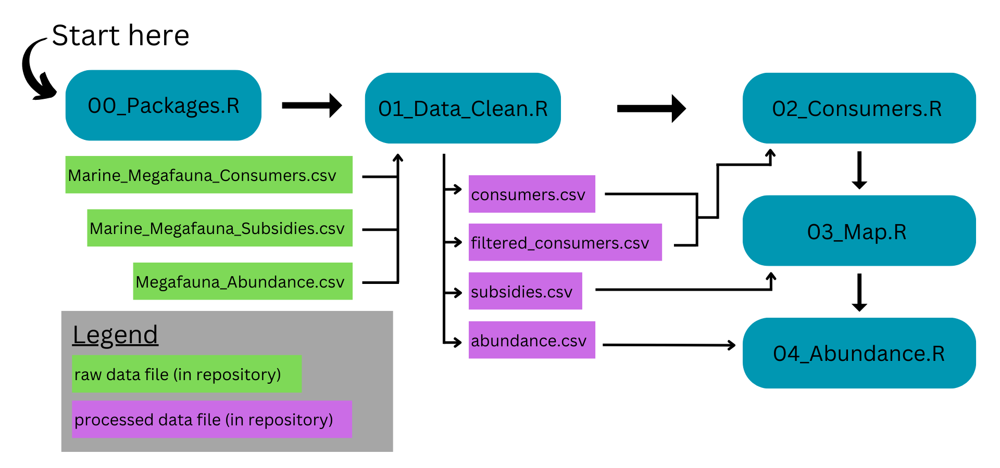

# Historical and potential future importance of marine megafauna subsidies to terrestrial ecosystems

**FD Gerraty**, C Braman, J Dugan, K Elder, K Emery, B Halpern, W Heady, E Hiroyasu, G Lewin, E Nielsen, R Oliver, M Reynolds, A Wegmann, R Williams, R Wynn-Grant, H Young, Z Zilz

Marine megafauna connect land and sea by serving as large, calorically-rich food sources for terrestrial consumers and by transferring marine-derived nutrients onto land as eggs, placenta, and excreta. In this project, we review the role of marine megafauna - particularly marine mammals and sea turtles - as connectors of marine and terrestrial ecosystems along global coastlines. We compile published literature to describe the diversity of terrestrial consumers that exploit marine megafauna as a food source, as well as descriptions of documented ecological consequences resulting from megafauna-mediated nutrient subsidies from marine to terrestrial ecosystems. Here, we provide an overview of the datasets and scripts associated with this repository.

------------------------------------------------------------------------

There are two primary datasets associated with this repository:

1.  **Marine Megafauna Consumers:** All of the terrestrial vertebrate consumers of marine megafauna captured in our synthetic literature review (see manuscript for review methods). The cleaned dataset is accessible at [`data/processed/consumers.csv`](https://github.com/fgerraty/Marine_Megafauna_Subsidies/blob/main/data/processed/consumers.csv). See [`data/README.md`](https://github.com/fgerraty/Marine_Megafauna_Subsidies/blob/main/data/README.md) for data dictionary and additional details.

2.  **Marine Megafauna Subsidies:** All of the case studies captured in our synthetic literature review that documented an ecological consequence in terrestrial ecosystems arising from (1) marine megafauna consumption by terrestrial consumers, (2) marine megafauna vectored nutrient subsidies to terrestrial ecosystems, or (3) indirect effects of marine megafauna. The cleaned dataset is accessible at [`data/processed/subsidies.csv`](https://github.com/fgerraty/Marine_Megafauna_Subsidies/blob/main/data/processed/subsidies.csv). See [`data/README.md`](https://github.com/fgerraty/Marine_Megafauna_Subsidies/blob/main/data/README.md) for data dictionary and additional details.

There is one additional dataset associated with this repository, "Marine Megafauna Abundance" ([`data/processed/abundance.csv`](https://github.com/fgerraty/Marine_Megafauna_Subsidies/blob/main/data/processed/abundance.csv)) that is derived from [Lotze and Worm (2009)](https://doi.org/10.1016/j.tree.2008.12.004) and includes historical and recent abundance estimates of marine mammal and sea turtle populations. See [`data/README.md`](https://github.com/fgerraty/Marine_Megafauna_Subsidies/blob/main/data/README.md) for data dictionary and additional details.

------------------------------------------------------------------------

There are four primary R scripts required to run all console and data preparation, data cleaning, analysis, and visualization steps:

-   **00_Packages.R** loads every package that is needed in following scripts. After running this script, all following scripts can be run independently.

-   **01_Data_Clean.R** cleans and summarizes raw data files. It also calculates values and summaries presented in the manuscript main text.

-   **02_Consumers.R** generates the sankey/alluvial plots in Figure 2.

-   **03_Map.R** generates the maps and histograms in Figure 3.

-   **04_Abundance.R** generates Figure 4.

------------------------------------------------------------------------

## Marine Megafauna and Consumer Species Pairs

In our literature review we identified 224 unique combinations (235 total, but these were not necessarily unique due to uncertainty of megafauna or consumer taxonomic level) between a marine megafauna species and a terrestrial vertebrate consumer species. These are outlined here, with more detail including taxonomic details and reference links accessible at [**data/processed/consumers.csv**](https://github.com/fgerraty/Marine_Megafauna_Subsidies/blob/main/data/processed/consumers.csv)

| Marine Megafauna Species | Consumer Species | Interaction Type(s) | Source(s) |
|:--------------|:--------------|:--------------|:---------------------------|
| **Cetaceans** |  |  |  |
| "cetacean" | Brown hyaena | Scavenging | Kuhn et al. (2010) |
| "dolphin" | Jaguar | Scavenging | Castañeda et al. (2013) |
| "dolphin" | Black-backed jackal | Unknown | Avery et al. (1987) |
| "whales" | Wolverine | Scavenging | Rausch and Pearson (1972) |
| "whales" | California condor | Scavenging | Chamberlain et al. (2005) |
| "whales" | Andean condor | Scavenging | Lambertucci et al. (2018) |
| "baleen whale" | Black-backed jackal | Unknown | Avery et al. (1987) |
| Beluga | Polar bear | Predation | Laidre et al. (2018), Smith and Sjare (1990), Rode et al. (2022) |
| Beluga | Gray wolf | Scavenging | Watts et al. (2010) |
| Bowhead whale | Polar bear | Scavenging | Laidre et al. (2018), Harwood et al. (2018), Rode et al. (2022) |
| Bowhead whale | Brown bear | Scavenging | Harwood et al. (2018) |
| Bryde's whale | Coyote | Unknown | Rose et al. (1998) |
| Common dolphin | Coyote | Unknown | Rose et al. (1998) |
| Cuvier’s beaked whale | Dingo | Scavenging | Behrendorff et al. (2016) |
| Fin whale | Polar bear | Scavenging | Laidre et al. (2018) |
| Fin whale | Coyote | Unknown | Rose et al. (1998) |
| Gray whale | Polar bear | Scavenging | Laidre et al. (2018) |
| Gray Whale | California condor | Scavenging | Kurle et al. (2016), Burnett et al. (2013) |
| Grey whale | Gray wolf | Scavenging | Watts et al. (2010), Roffler et al. (2023) |
| Harbor porpoise | Red fox | Scavenging | Heers et al. (2017) |
| Harbor porpoise | Gray wolf | Unknown | Roffler et al. (2023) |
| Humpback whale | Brown bear | Scavenging | Lewis et al. (2014) |
| Humpback whale | Gray wolf | Scavenging | Lewis et al. (2014), Young et al (2022) |
| Humpback whale | Dingo | Scavenging | Behrendorff et al. (2016), Behrendorff et al (2018) |
| Humpback whale | Turkey vulture | Scavenging | Blásquez et al. (2016) |
| Humpback whale | Bald eagle | Scavenging | Young et al. (2022) |
| Humpback whale | Corvid (Corvidae) | Scavenging | Young et al. (2022) |
| Humpback whale | Gull (Laridae) | Scavenging | Young et al. (2022) |
| Humpback whale | Great blue heron | Scavenging | Young et al. (2022) |
| Humpback whale | American robin | Scavenging | Young et al. (2022) |
| Indo-pacific bottlenose dolphin | Dingo | Scavenging | Behrendorff et al. (2016) |
| Melon-headed whale | Dingo | Scavenging | Behrendorff et al. (2016), Behrendorff et al (2018) |
| Minke whale | Dingo | Scavenging | Behrendorff et al. (2016) |
| Narwhal | Polar bear | Predation, Scavenging | Laidre et al. (2018), Smith and Sjare (1990), Stern et al. (2024) |
| Orca | Dingo | Scavenging | Behrendorff et al. (2016) |
| Orca | Gray wolf | Scavenging | Roffler et al. (2023) |
| Pantropical spotted dolphin | Dingo | Scavenging | Behrendorff et al. (2016) |
| Pilot whale | Lion | Scavenging | Stander (2019) |
| Pygmy sperm whale | Dingo | Scavenging | Behrendorff et al. (2016) |
| Risso's dolphin | California condor | Scavenging | Kurle et al. (2016) |
| Sperm whale | Polar bear | Scavenging | Laidre et al. (2018) |
| Sperm whale | Dingo | Scavenging | Behrendorff et al. (2016) |
| Sperm whale | Gray wolf | Unknown | Roffler et al. (2023) |
| **Fissipeds** |  |  |  |
| Sea otter | Bald eagle | Predation, Scavenging | Sherrod et al. (1975), Anthony et al. (2008) |
| Sea otter | Raven | Scavenging | Esslinger (1999) |
| Sea otter | Brown bear | Predation | Monson et al. (1995), Monson et al. (2022) |
| Sea otter | Gray wolf | Predation, Scavenging | Watts et al. (2010), Roffler et al. (2021), Roffler et al. (2023) |
| Sea otter | California condor | Scavenging | Burnett et al. (2013) |
| Sea otter | Wolverine | Scavenging | Schneider and Faro (1975) |
| Sea otter | Red fox | Scavenging | Schneider and Faro (1975) |
| Sea otter | Coyote | Predation | Riedman and Estes (1990) |
| **Pinnipeds** |  |  |  |
| "seal" | Red fox | Scavenging | Schwemmer et al. 2021) |
| "seals" | Wolverine | Scavenging | Rausch and Pearson (1972) |
| "seals" | California condor | Scavenging | Chamberlain et al. (2005) |
| Antarctic fur seal | Brown skua | Scavenging, Consuming placenta | Carneiro et al. (2014) |
| Antarctic fur seal | Northern giant petrel | Scavenging | Gonzales-Solis et al. (2000) |
| Antarctic fur seal | Southern giant petrel | Scavenging | Gonzales-Solis et al. (2000) |
| Bearded seals | Polar bear | Predation | Stirling and Derocher (2012), Stern et al. (2024), Rode et al. (2022) |
| Bearded seals | Arctic fox | Scavenging | Smith (1980) |
| Bearded seals | Raven | Scavenging | Smith (1980) |
| California sea lion | California condor | Predation, Scavenging | Kurle et al. (2016), Tyner et al. (2013), Burnett et al. (2013) |
| California sea lion | Coyote | NA | Reid et al. (2018) |
| California sea lion | Gull (Laridae) | Scavenging | Varland et al. (2015) |
| California sea lion | Western gull | Consuming placenta | Aurioles and Llinas (1987) |
| California sea lion | Bald eagle | Scavenging | Varland et al. (2015) |
| California sea lion | Raven | Scavenging | Varland et al. (2015) |
| California sea lion | Turkey vulture | Scavenging | Varland et al. (2015) |
| California sea lion | Coyote | Unknown | Rose et al. (1998) |
| California sea lion | Mountain lion | Unknown | Wilton (2016) |
| Cape fur seal | Brown hyaena | Predation, Scavenging | Kuhn et al. (2010) |
| Cape fur seal | Black-backed jackal | Predation, Scavenging, Consuming placenta | Hiscocks and Perrin (1987), Oosthuizen et al. (1997) |
| Cape fur seal | Lion | Predation, Scavenging | Bridgeford (1984), Stander (2019) |
| Cape fur seal | Kelp gull | Predation | Gallagher et al (2015) |
| Galapagos fur seal | Galapagos hawk | Scavenging | Weisberg and Perez (2018) |
| Galapagos sea lion | Española mockingbird | Predation, Consuming placenta | Curry and Anderson (1987) |
| Galapagos sea lion | Vampire ground finch | Consuming placenta | Grant and Grant (2002) |
| Galapagos sea lion | Galapagos marine iguana | Consuming placenta, Consuming excreta | Wikelski and Wrege (2000) |
| Galapagos sea lion | Galapagos hawk | Scavenging | Weisberg and Perez (2018) |
| Grey seal | Herring gull | Scavenging | Ronconi et al. (2014) |
| Grey seal | Great black-backed gull | Scavenging, Consuming placenta | Selva N. et al. (2019), Ronconi et al. (2014), Quaggiotto et al. (2018) |
| Grey seal | Red fox | Scavenging, Consuming placenta | Selva N. et al. (2019), Culloch et al. (2012) |
| Harbor seal | Bald eagle | Predation, Scavenging, Consuming placenta | Galusha and Hayward (2002), Hayward (2009), Calambokidis and Steiger (1985) |
| Harbor seal | Coyote | Predation | Steiger et al. (1989) |
| Harbor seal | Polar bear | Predation | Thiemann et al. (2008) |
| Harbor seal | Gray wolf | Predation, Scavenging | Collins et al. (2018), Roffler et al. (2021), Roffler et al. (2023) |
| Harbor seal | Gull (Laridae) | Scavenging | Varland et al. (2015) |
| Harbor seal | Raven | Scavenging | Varland et al. (2015) |
| Harbor seal | Turkey vulture | Scavenging | Varland et al. (2015) |
| Harbor seal | California condor | Scavenging | Kurle et al. (2016) |
| Harbor seal | Peregrine falcon | Scavenging | Varland (2018) |
| Harbor seal | Mountain lion | Unknown | Allen et al. (2019), Wilton (2016) |
| Harbor seal | Black bear | Unknown | Steiger et al. (1989) |
| Harp seal | Coyote | Predation | Way and Horton (2004) |
| Harp seal | Polar bear | Predation | Smith and Sterling (2019), Stern et al. (2024) |
| hooded seals | Polar bear | Predation | Thiemann et al. (2008), Stern et al. (2024) |
| New Zealand fur seal | Dingo | Scavenging | Behrendorff et al. (2016) |
| Northern elephant seal | Coyote | Unknown | Reid et al. (2018) |
| Ringed seals | Polar bear | Predation, Scavenging | Stirling and Derocher (2012), Rode et al. (2022), Smith (1980) |
| Ringed seals | Arctic fox | Predation, Scavenging | Roth (2002), Smith (1980), Lydersen and Gjertz (1986) |
| Ringed seals | Raven | Scavenging | Smith (1980) |
| South American sea lion | Black vulture | Predation, Scavenging | Paves et al. (2008) |
| South American sea lion | Common vampire bat | Predation | Catenazzi and Donnelly (2008) |
| South American sea lion | Dog | Scavenging | Paves et al. (2008) |
| South American sea lion | Kelp gull | Scavenging | Paves et al. (2008) |
| South American sea lion | Dolphin gull | Consuming excreta | Yorio et al. (1996) |
| South American sea lion | Andean condor | Scavenging, Consuming placenta | Reeves and Leatherwood (1992), Gamarra-Toledo et al. (2023) |
| South American fur seal | Kelp gull | Consuming excreta | Seguel et al. (2017) |
| South American fur seal | Dolphin gull | Consuming excreta | Seguel et al. (2017) |
| South American fur seal | Andean condor | Scavenging | Gamarra-Toledo et al. (2023) |
| Southern elephant seal | Northern giant petrel | Scavenging | de Bruyn and Cooper (2005) |
| Southern elephant seal | Southern giant petrel | Scavenging | de Bruyn and Cooper (2005) |
| Steller sea lion | Gray wolf | Unknown | Collins et al. (2018), Roffler et al. (2021), Roffler et al. (2023) |
| Subantarctic fur seal | Brown skua | Scavenging, Consuming placenta | Gamble et al. (2019), Ryan (2023) |
| Subantarctic fur seal | "giant petrel" (Macronectes spp.) | Scavenging | Reeves and Leatherwood (1992) |
| Walrus | Polar bear | Predation, Scavenging | Laidre et al. (2018) |
| Walrus | Wolverine | Scavenging | Rausch and Pearson (1972) |
| Walrus | Red fox | Scavenging | Zabel and Taggart (1989) |
| Walrus | Gray wolf | Scavenging | Watts et al. (2010) |
| **Sea Turtles** |  |  |  |
| "sea turtle" | King Vulture | Scavenging | Escobar-Lasso et al. (2016) |
| "sea turtle" | Black vulture | Scavenging, Consuming eggs | Escobar-Lasso et al. (2016), Burger and Gochfeld (2013), Madden et al. (2008) |
| "sea turtle" | Crested caracara | Scavenging | Escobar-Lasso et al. (2016) |
| "sea turtle" | Mangrove black-hawk | Scavenging | Escobar-Lasso et al. (2016) |
| "sea turtle" | Black iguana | Scavenging | Escobar-Lasso et al. (2016) |
| "sea turtle" | Northern raccoon | Scavenging | Escobar-Lasso et al. (2016), Madden et al. (2008) |
| "sea turtle" | Dog | Consuming eggs | Madden et al. (2008) |
| "sea turtle" | American crocodile | Scavenging | Escobar-Lasso et al. (2016) |
| "sea turtle" | Mountain lion | Scavenging | Escobar-Lasso et al. (2016) |
| "sea turtle" | Coyote | Scavenging | Escobar-Lasso et al. (2016) |
| "sea turtle" | Eastern spotted skunk | Consuming eggs | Mroziak et al. (2000) |
| "sea turtle" | Common opossum | Scavenging | Escobar-Lasso et al. (2016), Madden et al. (2008) |
| "sea turtle" | Turkey vulture | Scavenging | Escobar-Lasso et al. (2016) |
| "sea turtle" | Loo-choo big-tooth snake | Consuming eggs | Matsumoto et al. (2021) |
| Flatback sea turtle | Wild boar | Consuming eggs | Whytlaw et al. (2013), Nordberg et al. (2019) |
| Flatback sea turtle | Dingo | Consuming eggs | Nordberg et al. (2019) |
| Flatback sea turtle | Yellow-spotted monitor | Consuming eggs | Nordberg et al. (2019), Blamires (2004) |
| Green sea turtle | Jaguar | Predation | Arroyo-Arce and Salom-Pérez (2015), Alfaro et al. (2016), Veríssimo et al. (2012) |
| Green sea turtle | Dog | Consuming eggs | Fowler (1979), Ruiz-Izaguirre et al. (2014), Fowler (1979) |
| Green sea turtle | Coyote | Consuming eggs | Shaver et al. (2020) |
| Green sea turtle | Turkey vulture | Consuming eggs | Fowler (1979) |
| Green sea turtle | Black vulture | Consuming eggs | Fowler (1979) |
| Green sea turtle | White-nosed coati | Consuming eggs | Fowler (1979), Tiwari et al. (2006) |
| Green sea turtle | European badger | Consuming eggs | Yilmaz et al. (2015), Shaver et al. (2020) |
| Green sea turtle | Golden jackal | Predation, Consuming eggs | Yilmaz et al. (2015), Brown and Macdonald (1995) |
| Green sea turtle | Wild boar | Consuming eggs | Yilmaz et al. (2015), Zárate et al. (2013) |
| Green sea turtle | Red fox | Consuming eggs | Yilmaz et al. (2015), Halls et al. (2018), O'Connor et al. (2017) |
| Green sea turtle | Northern raccoon | Consuming eggs | Engeman et al. (2005), Engeman et al. (2011) |
| Green sea turtle | Nine-banded armadillo | Consuming eggs | Engeman et al. (2005), Engeman et al. (2011) |
| Green sea turtle | Black rat | Predation, Consuming eggs | Caut et al. (2007), Stokes et al. (2024) |
| Green sea turtle | Nile monitor | Consuming eggs | Sampaio et al. (2022) |
| Green sea turtle | Kukri snake | Consuming eggs | Lin et al. (2023), Pike et al. (2016) |
| Green sea turtle | Stink ratsnake | Consuming eggs | Lin et al. (2023) |
| Green sea turtle | White-tailed deer | Scavenging | Morera et al. (2022) |
| Hawksbill sea turtle | Jaguar | Predation | Arroyo-Arce and Salom-Pérez (2015), Veríssimo et al. (2012) |
| Hawksbill sea turtle | Wild boar | Consuming eggs | Whytlaw et al. (2013) |
| Hawksbill sea turtle | Mongoose | Consuming eggs | Leighton et al. (2010), Leighton et al. (2010), Leighton et al. (2008) |
| Kemp's ridley sea turtle | Coyote | Consuming eggs | Shaver et al. (2020) |
| Kemp's ridley sea turtle | American badger | Consuming eggs | Shaver et al. (2020) |
| Kemp's ridley sea turtle | Northern raccoon | Consuming eggs | Shaver et al. (2020) |
| Kemp's ridley sea turtle | Wild boar | Consuming eggs | Shaver et al. (2020) |
| Leatherback sea turtle | Jaguar | Predation | Arroyo-Arce and Salom-Pérez (2015), Veríssimo et al. (2012), Restrepo et al. (2022) |
| Leatherback sea turtle | Nine-banded armadillo | Consuming eggs | Engeman et al. (2005), Engeman et al. (2011), Lasala et al. (2023) |
| Leatherback sea turtle | Northern raccoon | Consuming eggs | Engeman et al. (2011), Lasala et al. (2023) |
| Leatherback sea turtle | Asian water monitor | Consuming eggs | Sivasundar and Prasad (1996) |
| Leatherback sea turtle | Crested caracara | Predation, Consuming eggs | Tomillo et al. (2010) |
| Leatherback sea turtle | Yellow-crowned night heron | Predation, Consuming eggs | Tomillo et al. (2010) |
| Leatherback sea turtle | Great blue heron | Predation, Consuming eggs | Tomillo et al. (2010) |
| Leatherback sea turtle | Dog | Consuming eggs | De Wet (2012) |
| Leatherback sea turtle | Coyote | Consuming eggs | Lasala et al. (2023) |
| Leatherback sea turtle | Honey badger | Consuming eggs | De Wet (2012) |
| Leatherback sea turtle | Mongoose | Consuming eggs | De Wet (2012) |
| Leatherback sea turtle | Monitor lizard (Varanus spp.) | Consuming eggs | De Wet (2012) |
| Loggerhead sea turtle | Lace monitor | Consuming eggs | Hof et al. (2019) |
| Loggerhead sea turtle | Yellow-spotted monitor | Consuming eggs | Nordberg et al. (2019), Hof et al. (2019), Lei and Booth (2017) |
| Loggerhead sea turtle | Northern raccoon | Predation, Consuming eggs | Bouchard and Bjorndal (2000), Engeman et al. (2005), Butler et al. (2020) |
| Loggerhead sea turtle | Black bear | Consuming eggs | Bjorndal (2020) |
| Loggerhead sea turtle | European badger | Consuming eggs | Yilmaz et al. (2015), Olgun et al. (2016), Baskale and Kaska (2013) |
| Loggerhead sea turtle | Red fox | Consuming eggs | Yilmaz et al. (2015), Olgun et al. (2016), Halls et al. (2018) |
| Loggerhead sea turtle | Gray fox | Predation, Consuming eggs | Stancyk (1982), Erb and Wyneken (2019) |
| Loggerhead sea turtle | Wild boar | Consuming eggs | Yilmaz et al. (2015), Nordberg et al. (2019), Olgun et al. (2016) |
| Loggerhead sea turtle | Golden jackal | Predation, Consuming eggs | Yilmaz et al. (2015) |
| Loggerhead sea turtle | Dingo | Consuming eggs | Nordberg et al. (2019) |
| Loggerhead sea turtle | Dog | Consuming eggs | Olgun et al. (2016), Patino-Martinez et al. (2021), Foote et al. (2000) |
| Loggerhead sea turtle | Nine-banded armadillo | Consuming eggs | Engeman et al. (2005), Butler et al. (2020), Engeman et al. (2011) |
| Loggerhead sea turtle | South American coati | Consuming eggs | López-Mendilaharsu et al. (2020) |
| Loggerhead sea turtle | Six-banded armadillo | Consuming eggs | López-Mendilaharsu et al. (2020) |
| Loggerhead sea turtle | Crab-eating fox | Consuming eggs | López-Mendilaharsu et al. (2020) |
| Loggerhead sea turtle | Coyote | Consuming eggs | Butler et al. (2020), Smith et al. (2020), Wauson and Rogers (2021) |
| Loggerhead sea turtle | Red wolf | Consuming eggs | Bailey et al. (1998) |
| Loggerhead sea turtle | Bobcat | Consuming eggs | Martin et al. (2005), Lindbord et al. (2016) |
| Loggerhead sea turtle | North American river otter | Consuming eggs | Butler et al. (2020) |
| Loggerhead sea turtle | American mink | Consuming eggs | Butler et al. (2020) |
| Loggerhead sea turtle | Honey badger | Consuming eggs | De Wet (2012) |
| Loggerhead sea turtle | Mongoose | Consuming eggs | De Wet (2012) |
| Loggerhead sea turtle | Eastern kingsnake | Consuming eggs | Butler et al. (2020) |
| Loggerhead sea turtle | Scarlet snake | Consuming eggs | Butler et al. (2019) |
| Loggerhead sea turtle | Coachwhip | Consuming eggs | Foote et al. (2000) |
| Loggerhead sea turtle | Eastern rat snake | Consuming eggs | Williams and Frick (2001) |
| Loggerhead sea turtle | Monitor lizard (Varanus spp.) | Consuming eggs | De Wet (2012) |
| Loggerhead sea turtle | Virginia opossums | Consuming eggs | Butler et al. (2020) |
| Loggerhead sea turtle | American crow | Consuming eggs | Butler et al. (2020) |
| Loggerhead sea turtle | Fish crow | Consuming eggs | Butler et al. (2020), Foote et al. (2000) |
| Loggerhead sea turtle | Black vulture | Consuming eggs | Stancyk (1982) |
| Loggerhead sea turtle | Turkey vulture | Consuming eggs | Stancyk (1982) |
| Loggerhead sea turtle | Great horned owls | Predation | Williams and Frick (2001) |
| Loggerhead sea turtle | Screech owls | Predation | Williams and Frick (2001) |
| Loggerhead sea turtle | Yellow-crowned night heron | Predation | Erb and Wyneken (2019), Bouchard and Bjorndal (2000) |
| Loggerhead sea turtle | Black-crowned night heron | Predation | Bouchard and Bjorndal (2000) |
| Loggerhead sea turtle | Gull (Laridae) | Predation | Erb and Wyneken (2019) |
| Olive ridley sea turtle | Jaguar | Predation | Alfaro et al. (2016), Escobar-Lasso et al. (2016), Morera-Chacón et al. (2019) |
| Olive ridley sea turtle | Wild boar | Consuming eggs | Whytlaw et al. (2013) |
| Olive ridley sea turtle | Asian water monitor | Consuming eggs | Maulany et al. (2012) |
| Olive ridley sea turtle | Dog | Predation, Consuming eggs | Reavis et al. (2022), Tripathy and Rajasekhar (2009), Espinoza-Rodríguez et al. (2023) |
| Olive ridley sea turtle | Northern raccoon | Consuming eggs | Reavis et al. (2022), Espinoza-Rodríguez et al. (2023) |
| Olive ridley sea turtle | Wood stork | Predation, Consuming eggs | Burger and Gochfeld (2013), Burger and Gochfeld (2014) |
| Olive ridley sea turtle | House crow | Predation | Tripathy and Rajasekhar (2009) |
| Olive ridley sea turtle | Brahminy kite | Predation | Tripathy and Rajasekhar (2009) |
| Olive ridley sea turtle | Black-headed gull | Predation | Tripathy and Rajasekhar (2009) |
| Olive ridley sea turtle | Black vulture | Predation, Consuming eggs | Burger and Gochfeld (2014), Burger and Gochfeld (2014), Espinoza-Rodríguez et al. (2023) |
| Olive ridley sea turtle | Striped hyena | Consuming eggs | Tripathy and Rajasekhar (2009) |
| Olive ridley sea turtle | Golden jackal | Consuming eggs | Tripathy and Rajasekhar (2009) |
| Olive ridley sea turtle | White-nosed coati | Consuming eggs | Garcıía et al. (2003), Espinoza-Rodríguez et al. (2023) |
| Olive ridley sea turtle | White-tailed deer | Scavenging | Morera et al. (2022) |
| Olive ridley sea turtle | Striped skunk | Consuming eggs | Espinoza-Rodríguez et al. (2023) |
| Olive ridley sea turtle | Tayra | Consuming eggs | Espinoza-Rodríguez et al. (2023) |
| Olive ridley sea turtle | Common opposum | Consuming eggs | Espinoza-Rodríguez et al. (2023) |
| Olive ridley sea turtle | Crested caracara | Predation, Consuming eggs | Espinoza-Rodríguez et al. (2023), Burger and Gochfeld (2014) |
| Olive ridley sea turtle | Great-tailed grackle | Predation, Consuming eggs | Burger and Gochfeld (2014) |
| Olive ridley sea turtle | Magnificent frigatebird | Predation | Burger and Gochfeld (2014) |
| Olive ridley sea turtle | Yellow-crowned night heron | Predation, Consuming eggs | Burger and Gochfeld (2014) |
| Olive ridley sea turtle | Coyote | Consuming eggs | Sosa-Cornejo et al. (2021) |
| Olive ridley sea turtle | Chicken | Consuming eggs | Burger and Gochfeld (2014) |
| Olive ridley sea turtle | Dingo | Consuming eggs | Whiting et al. (2007) |
| Olive ridley sea turtle | Turkey vulture | Consuming eggs | Burger and Gochfeld (2014) |
| **Sirenians** |  |  |  |
| Amazon manatee | Jaguar | Predation | Bertram and Bertram (1973) |
| Dugong | Dingo | Scavenging | Behrendorff et al. (2016), Behrendorff et al (2018) |
